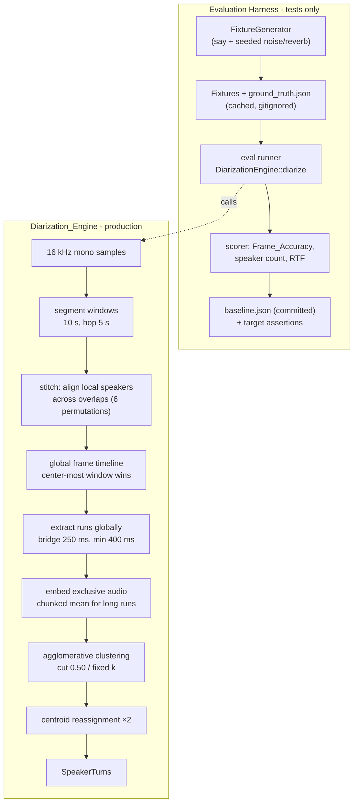

# Design Document: Diarization Accuracy

## Overview

Two workstreams, in dependency order: (1) an **evaluation harness** that generates ground-truth fixtures, runs the real engine on them, and asserts Frame_Accuracy / speaker-count / RTF targets — making every subsequent change measurable; (2) **engine accuracy improvements** that attack the documented weaknesses of the current implementation.

Research grounding:

- `tasks/diarization/D1-resultados.md` records the baselines (99.5% sequential, 94.2% overlapped mono, 100% separate-track, RTF ≤ 0.022) and explicitly lists the accuracy limitations this design addresses: **non-overlapping 10 s windows without stitching** ("Em D3 vale usar overlap + costura para robustez nas bordas") and thresholds calibrated only on clean synthetic audio.
- Current engine (`frontend/src-tauri/src/diarization_engine/engine.rs`): `extract_regions` iterates disjoint 10 s windows; speech runs are cut at every window boundary, the 400 ms minimum-duration filter is applied **per window fragment** (a 700 ms utterance straddling a boundary as 350 ms + 350 ms is dropped entirely), and per-frame decisions near window edges lack acoustic context. Production pyannote uses overlapping sliding windows with stitching for exactly this reason.
- Embeddings: one embedding per region regardless of length; long regions waste audio that could stabilize the embedding, and average-linkage chaining can attach short/noisy regions to the wrong cluster with no correction pass.

Key decisions (rationale inline):

1. **Overlapping windows (hop = 5 s) + permutation stitching** — the model's 3 local speaker slots are window-local, so consecutive windows are aligned by choosing the local-speaker permutation (3! = 6 candidates, trivial cost) that maximizes frame agreement on the 5 s overlap. Frames covered by two windows take the decision from the window where the frame is farther from an edge ("center-most wins") — deterministic, no probability calibration needed.
2. **Global run extraction** — gap bridging (≤ 250 ms) and the 400 ms minimum are applied on the stitched whole-recording timeline, not per window. Directly satisfies Requirements 3.1/3.2.
3. **Chunked embedding averaging** — regions longer than 6 s embed per ~3 s exclusive chunk; the L2-normalized mean is the region embedding. More audio → lower embedding variance, which is what degrades the overlapped/noisy scenarios.
4. **Centroid reassignment pass** — after agglomerative clustering, 2 iterations of nearest-centroid reassignment correct chaining mistakes. Skipped when a Speaker_Count_Hint fixes k=1 (nothing to reassign).
5. **Thresholds unchanged** (cut 0.50, identification 0.65) — D1 showed a wide stable plateau (0.35–0.60); the harness will tell us if the new embeddings shift it, and only then would we retune.
6. **Fixtures via macOS `say`** — ports the D1 spike's `make_audio.py` approach into Rust test support code; ground truth falls out of scripted placement. Degradation (noise at 10 dB SNR + synthetic room impulse response) is seeded and deterministic.

## Architecture

The feature only touches the engine internals and test infrastructure. Public surfaces (`DiarizationEngine::diarize`, `SpeakerTurn`, Tauri commands, attribution, identity registry) keep their contracts.



## Components and Interfaces

All code is Rust. Engine changes live in `frontend/src-tauri/src/diarization_engine/engine.rs` (new private helpers alongside the existing `extract_regions`); harness code lives in `frontend/src-tauri/tests/diarization_accuracy.rs` plus a `tests/support/` module.

### 1. Window stitcher (engine, replaces the per-window loop in `extract_regions`)

```rust
/// Whole-recording per-frame speaker activity after stitching overlapping windows.
struct StitchedTimeline {
    /// Seconds per segmentation frame (~17 ms).
    step: f32,
    /// Per frame: bitmask over global track ids of active speakers.
    active: Vec<u64>,
    /// Per frame: the single exclusive global track id, if exactly one speaker.
    exclusive: Vec<Option<usize>>,
    /// Number of global tracks allocated.
    n_tracks: usize,
}

/// Run segmentation over sliding windows (SEG_WINDOW, hop SEG_WINDOW/2) and
/// stitch local speaker slots into global tracks.
///
/// Preconditions: `audio` is 16 kHz mono.
/// Postconditions: `active.len() == exclusive.len()`; every track id referenced
/// is `< n_tracks`; timeline duration covers `audio.len()` samples.
fn stitch_windows(
    model: &mut DiarizationModel,
    audio: &[f32],
) -> Result<StitchedTimeline, DiarizationModelError>;

/// Choose the permutation of window `w+1`'s local speakers that maximizes
/// per-frame agreement with window `w` over their overlap region.
/// Local speakers with no agreement (new voices) get fresh global track ids.
fn align_local_speakers(
    prev_overlap: &[[bool; LOCAL_SPEAKERS]],
    next_overlap: &[[bool; LOCAL_SPEAKERS]],
) -> [usize; LOCAL_SPEAKERS]; // local idx -> global track id (relative mapping)
```

Notes:

- Frame alignment between windows is computed by time (`frame_time = win_start + f * step`), rounding to the nearest frame of the other window — the pyannote frame grid (589 frames / 10 s) does not divide evenly at hop boundaries.
- Overlapped frames: the winning window is the one where the frame index is farther from `0` and `frames-1` (more receptive-field context). Last/first windows of the recording keep their edge decisions (no better source exists).
- A speaker absent for an entire window loses slot continuity and later reappears as a new global track; global clustering merges the tracks afterwards, same as today.

### 2. Global run extraction + chunked embeddings (engine)

```rust
/// Extract per-track speech runs from the stitched timeline: bridge gaps
/// <= 250 ms, drop runs < 400 ms — both measured on the global timeline.
fn extract_runs(timeline: &StitchedTimeline) -> Vec<Run>; // Run { track, start_f, end_f }

/// Embed a run from its exclusive samples. Runs longer than 6 s are split into
/// ~3 s exclusive chunks, embedded separately, and averaged (then re-normalized).
/// Falls back to the whole-run samples when exclusive audio < 333 ms (unchanged).
/// Returns None when the embedding model yields no stable features (run is
/// then excluded from clustering — Requirement 4.3).
fn embed_run(
    model: &mut DiarizationModel,
    audio: &[f32],
    timeline: &StitchedTimeline,
    run: &Run,
) -> Result<Option<Region>, DiarizationModelError>;
```

### 3. Centroid reassignment (engine)

```rust
/// Refine agglomerative labels: recompute cluster centroids (normalized mean)
/// and reassign each embedding to its nearest centroid by cosine similarity.
/// `iters` = 2. Preserves the number of clusters: a reassignment that would
/// empty a cluster is rejected (keeps Speaker_Count_Hint semantics, Req 4.2).
/// Postconditions: output labels are contiguous 0..k and k == input k.
fn refine_clusters(embeddings: &[Vec<f32>], labels: &mut [usize], iters: usize);
```

`DiarizationEngine::diarize` keeps its exact signature and behavior contract; only the internal pipeline between `samples` and `SpeakerTurn`s changes.

### 4. Fixture generator (test support, `frontend/src-tauri/tests/support/fixtures.rs`)

```rust
pub struct Utterance { pub speaker: usize, pub text: &'static str, pub start_secs: f32 }
pub struct FixtureSpec {
    pub name: &'static str,
    pub voices: &'static [&'static str],   // macOS `say` voices, one per speaker
    pub script: &'static [Utterance],      // scripted placement = ground truth
    pub degrade: Option<Degradation>,      // None = clean
}
pub struct Degradation { pub snr_db: f32, pub rt60_secs: f32, pub seed: u64 }

pub struct Fixture {
    pub samples_16k: Vec<f32>,
    /// Ground truth: per speaker, list of (start, end) actually rendered —
    /// derived from the measured duration of each synthesized clip.
    pub truth: Vec<Vec<(f32, f32)>>,
}

/// Synthesize (or load from cache) a fixture. Returns Err(Skip) when `say`
/// is unavailable on the host.
pub fn build_fixture(spec: &FixtureSpec, cache_dir: &Path) -> Result<Fixture, SkipReason>;
```

- Synthesis: `say -v <voice> -o clip.wav --data-format=LEI16@16000 "<text>"` per utterance, decoded with `hound`; each clip's *measured* duration produces the ground-truth spans (Requirement 1.5), so TTS timing variation cannot desynchronize truth from audio. Cached under `tests/data/diarization/cache/` (gitignored); cache key = hash of spec + generator version constant (Requirement 1.9).
- Degradation (Requirement 1.3): noise = one-pole low-passed white noise from `StdRng::seed_from_u64(seed)`, scaled so `10*log10(rms_speech²/rms_noise²) = 10 dB`; reverb = convolution (via `realfft`, already a dependency) with a synthetic RIR: unit impulse + seeded noise tail shaped by `exp(-6.9 t / rt60)`, `rt60 = 0.3 s`. Fully deterministic for a fixed seed.
- New dev-dependency: `rand` (if not already in the tree) — dev-only, does not ship in the app.

### 5. Eval runner + scorer (`frontend/src-tauri/tests/diarization_accuracy.rs`)

```rust
struct EvalResult { name: String, frame_accuracy: f64, detected: usize, expected: usize, rtf: f64 }

/// 100 ms frames; best cluster->speaker mapping via exhaustive permutation
/// (<= 3 speakers, as in the D1 spike scorer).
fn score(turns: &[SpeakerTurn], truth: &[Vec<(f32, f32)>], duration: f32) -> EvalResult;
```

- Skips (with an explicit `eprintln!` skip message) when the ONNX models are absent from the models directory (`MEETILY_DIARIZATION_MODELS_DIR` env override, defaulting to the dev path `frontend/models/diarization`) — Requirement 1.7 — or when `say` is unavailable — Requirement 1.8.
- RTF timing wraps only `DiarizationEngine::diarize` (Requirement 7.2).
- Baseline: `tests/data/diarization/baseline.json` (committed). Running with `DIARIZATION_EVAL_RECORD_BASELINE=1` rewrites it; normal runs assert `frame_accuracy >= max(target, baseline)` per fixture (Requirements 2.x).
- Fixture set: `seq3`, `overlap3`, `track2`, `seq3_degraded`, `overlap3_degraded` (Requirements 1.2, 1.3).
- Identity stability check (Requirement 6.3): synthesize two different-text clips of the same voice, run each through segmentation+embedding, assert cosine similarity ≥ `IDENTIFICATION_COSINE_SIMILARITY`.

## Data Models

No database or API changes. New/changed data artifacts:

- `StitchedTimeline`, `Run` — private engine types (above).
- `tests/data/diarization/baseline.json` (committed):

```json
{
  "generator_version": 1,
  "recorded_at_commit": "<sha>",
  "fixtures": {
    "seq3":            { "frame_accuracy": 0.0, "detected": 0 },
    "overlap3":        { "frame_accuracy": 0.0, "detected": 0 },
    "track2":          { "frame_accuracy": 0.0, "detected": 0 },
    "seq3_degraded":   { "frame_accuracy": 0.0, "detected": 0 },
    "overlap3_degraded": { "frame_accuracy": 0.0, "detected": 0 }
  }
}
```

  (Values are filled by the baseline-recording run on the unmodified engine — Requirement 1.10.)
- `tests/data/diarization/cache/` — generated WAVs + `ground_truth.json`, gitignored.

## Correctness Properties

Properties are universally quantified statements derived from acceptance criteria, validated by seeded randomized tests (no property-testing dependency added; each test draws N=200 cases from a fixed-seed `StdRng`).

**Property 1: Shift invariance**
For all fixtures F and silence prefixes of duration d ∈ [0, 5] s: diarizing silence+F yields the same number of turns as F, with each turn's start/end shifted by d within ±250 ms and an identical cluster grouping (up to label renaming).
**Validates: Requirements 3.3**

**Property 2: Fixed-k clustering**
For all non-empty embedding sets E and hints k ∈ [1, |E|]: `cluster_agglomerative(E, _, Some(k))` followed by `refine_clusters` produces labels that are contiguous `0..k` and use exactly k distinct values.
**Validates: Requirements 4.2**

**Property 3: Reassignment preserves cluster count**
For all embedding sets E and initial labelings L with k clusters: after `refine_clusters(E, L, 2)`, the number of distinct labels is still k.
**Validates: Requirements 4.2**

**Property 4: Greatest-overlap attribution**
For all turn sets T and segments s: `assign_speakers` labels s with the speaker whose summed temporal overlap with s is maximal, and leaves s unassigned when every overlap is zero.
**Validates: Requirements 5.1, 5.2**

**Property 5: Stitching is permutation-invariant**
For all window activity matrices and permutations p of local speaker slots in one window: applying p before stitching yields an identical global timeline (up to global track renaming).
**Validates: Requirements 3.1**

## Error Handling

| Condition | Response | Requirement |
|---|---|---|
| ONNX models absent at eval time | Test prints explicit skip message, exits OK | 1.7 |
| `say` unavailable / synthesis fails | Test prints explicit skip message, exits OK | 1.8 |
| Fixture cache corrupt (hash mismatch, undecodable WAV) | Regenerate fixture, overwrite cache | 1.9 |
| `embed_run` returns `None` (audio too short for stable features) | Run excluded from clustering; remaining runs processed | 4.3 |
| Segmentation window inference error | `diarize` returns `Err` (unchanged current behavior); job surfaces the error via existing progress events | — |
| Baseline file missing on assert run | Test fails with a message instructing to run with `DIARIZATION_EVAL_RECORD_BASELINE=1` | 1.10 |

## Testing Strategy

- **Unit tests** (in-module, plain `#[test]`, following the existing `engine.rs` test style): `align_local_speakers` on hand-built overlap matrices; global `extract_runs` on synthetic timelines including the boundary-straddling 350 ms + 350 ms case (Requirement 3.2); degradation determinism (same seed → identical samples); SNR of degraded output within ±0.5 dB of 10 dB.
- **Property tests**: the five properties above, seeded randomized (fixed seeds, reproducible failures).
- **Evaluation harness** (integration test `diarization_accuracy.rs`): the five fixtures, target + baseline assertions, RTF bound, identity-stability check. Skip-not-fail on missing models/TTS so `cargo test` stays green on machines without them; CI (macos-26) has `say` and can download models in a dedicated job if desired (out of scope here).
- **Regression order**: baseline is recorded from the unmodified engine *before* any engine change lands (task ordering enforces this), so every accuracy change is measured against the true current state.

## Post-implementation notes

- **Overlap stitching weighting**: soft triangular overlap weighting (activity threshold 0.42, `ALIGN_MATCH_IOU` 0.80) replaced the original binary center-most-wins assignment after an empirical parameter sweep — the triangular weights resolve boundary frames more accurately on overlapping speech.
- **Centroid reassignment**: the centroid-refinement reassignment pass verified as a no-op on the current fixture set (no frames changed cluster). It is retained for fixed-k clustering semantics and future robustness rather than for a measured gain today.
- **Chunked embeddings**: chunked embedding rarely triggers on the ~45 s fixtures, since most speaker runs carry well under 4 s of exclusive audio; the chunking path exists for longer real-world runs.
